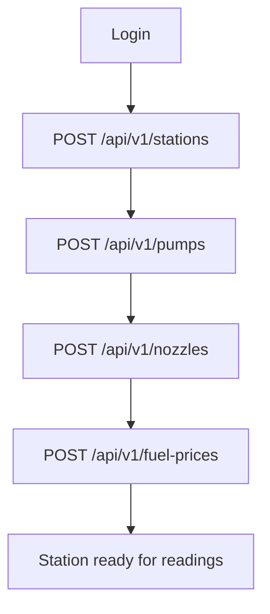
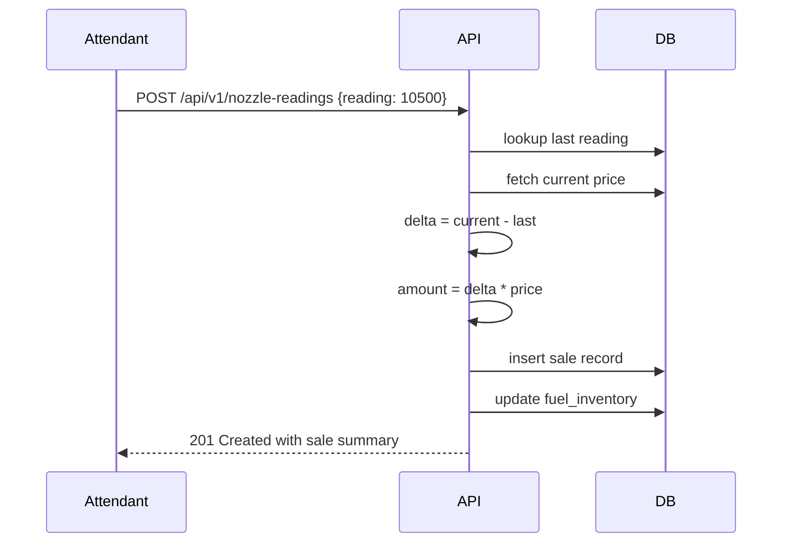
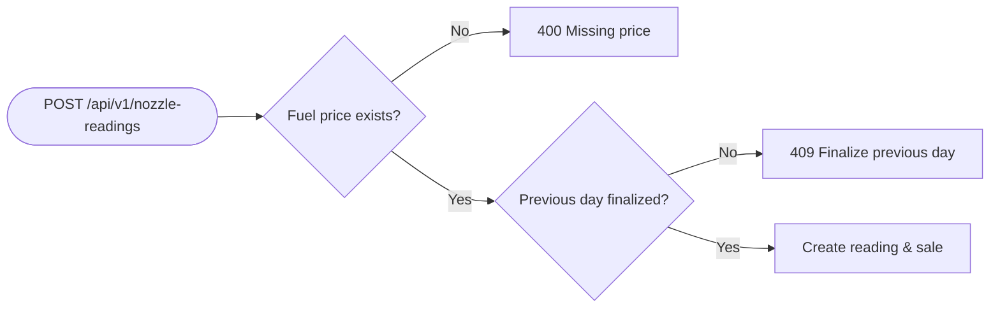
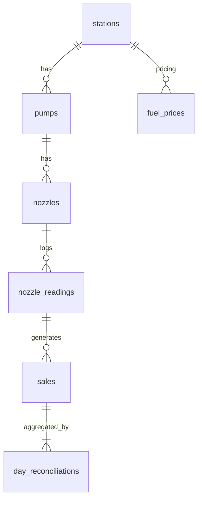

# USER_API_FLOW.md — Station Setup & Daily Operations

This document visualizes the typical user journey and associated API calls when configuring a new station and recording daily nozzle readings.

## Owner / Manager Station Setup


## Attendant Daily Reading Entry
```mermaid
flowchart TD
    alogin[Login] --> checkPrice[GET /api/v1/fuel-prices]
    checkPrice --> canCreate[GET /api/v1/nozzle-readings/can-create/{nozzleId}]
    canCreate -- Allowed --> record[POST /api/v1/nozzle-readings]
    canCreate -- Not Allowed --> halt[Stop: finalize previous day]
```

These flows show the sequential API calls from initial station setup to daily nozzle reading entry. Reading creation generates sales automatically once the station hierarchy and fuel prices are in place.

## Sale Calculation & Fuel Price Use


Example: if last reading was **10,000 L** and current reading is **10,500 L** at **₹102/L**, the generated sale has volume **500 L** and amount **₹51,000**.

## Validation & Edge Cases


## Analytics & Reconciliation Flow
```mermaid
flowchart TD
    salesTbl[(sales)] --> reconAPI[POST /api/v1/reconciliations]
    reconAPI --> reconTbl[(day_reconciliations)]
    salesTbl --> analyticsAPI[GET /api/v1/analytics/station/{id}]
    analyticsAPI --> dashboard[Dashboard metrics]
```

## Database Relations Overview

